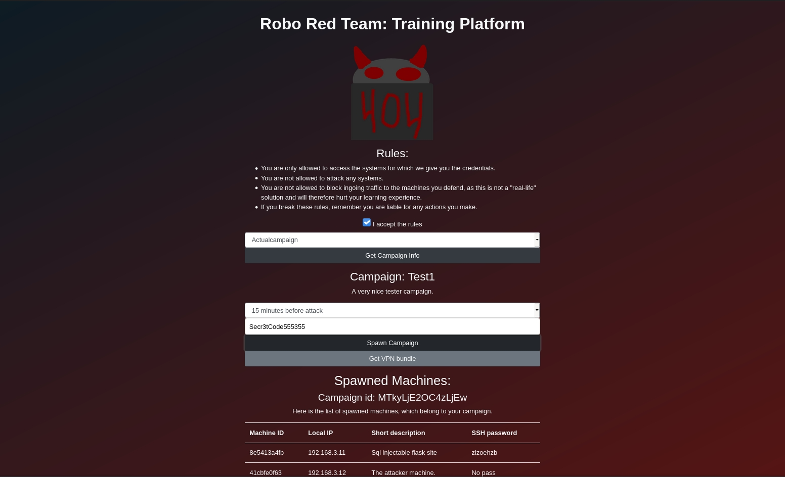
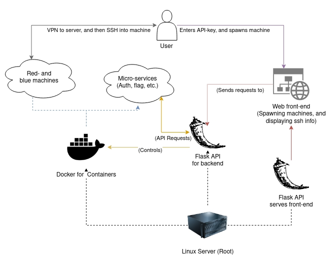
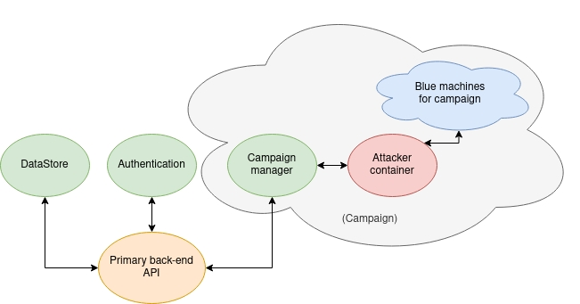
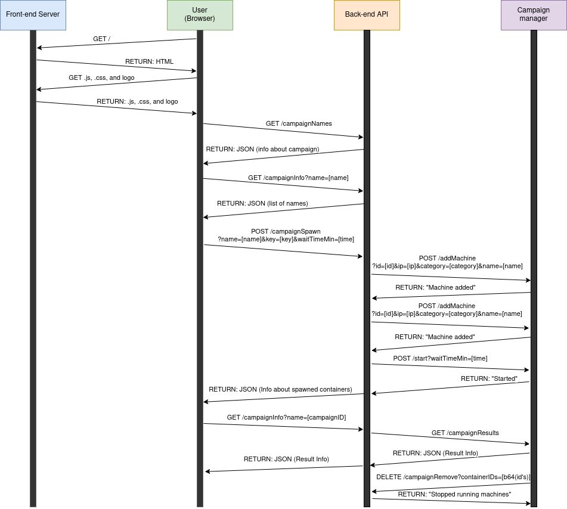

# Robo Red Team: Training-Platform
A training platform for blue team cybersecurity professionals developed as a semester's project during our studies for an MSc in Cybersecurity.



Users go to a webpage where they enter an API-key and then chose a challenge. Then the backend will spawn the corresponding challenge-containers. The platform will then give the user VPN access to the internal network on the machine, from where they will be able to SSH into their containers with the given credentials. Now the goal is to find and mitigate the security flaws in the machine before the timer runs out, and the automated attacker machine will run attacks against the machine. Once the attack-script has run, the users can see if they were successful in their mitigations on the webpage. 

## How to run:
To run this, you need to be on a Linux-based system. First, you will need to run:
```
sudo bash install.sh [pacman/apt]
```
This will install the needed packages and Python dependencies. There is support for 'pacman' and 'apt', if no param is given, then it will tell which packages to install.

Once you have installed the needed packages, then you can start the service with:
```
bash start.sh [API key]
```
*Note: You might have to run as root (sudo), in case Docker needs these privileges.*

## Design of the Training Platform
The platform design is intended to allow for easy scalability, by utilizing a micro-service architecture. 



As seen in the figure above, we are utilizing Docker for the micro-services in the backend, along with encapsulation for each challenge to which the users gain access. To run the backend we have chosen to utilize Flask-RESTful as our primary API, which is the same technology we temporarily use as the server of the frontend. 



As seen in the figure above, we have structured the backend into different micro-services. 
* Firstly we have the "DataStore" service, which acts as a temporary replacement for a database, by storing and serving static information.
* The "Authentication" service holds the hashed and salted version of the key, which the backend uses to verify if the given API-key is valid. 
* Next we have all of the micro-services connected with a campaign:
  * The "CampaignManager" service is the only point-of-contact between the campaign and the backend and is used to manage communication between these two parts of the backend infrastructure. 
  * The attacker container is the machine that will run an attack-script against the "blue machines", and report back on the status of the attacks.
  * The "blue machines" are the ones who the users will gain access to harden the security of the machines. 



The above figure displays the communication between the various micro-services from the point where the user accesses the frontend, to the containers associated with a campaign being stopped. 

## Future Work
We do not intend to develop this platform further, which is why we have decided to open-source it under a GPL-3.0 license. If you intend to use our code as a base for your further development of a blue-team training platform, then feel free to reach out if you wish to gain more knowledge about our development decisions, and our observations in regards to improvements to the platform. 

Below is a list of improvements we would encourage you to do if you wish to use our code as the base of your platform:
* Build a mechanism that ensures a *"one campaign pr user/API-key"* policy is kept, as it now is possible to DoS the service by spawning a large number of containers if you know the valid API-key.
* Implement a database and support for users.
* Develop more campaigns, to give more content to the users.
* Ensure that the communication will be done encrypted via HTTPS.
* Build protection into the networking of the system, so that the "blue machines" do not have internet access *(or only limited internet access)*
* Chose a better way to serve the backend API, and the frontend, which is more scalable than the Flask development server.
*  Utilize Kubernetes for making the platform able to scale automatically. 
* Improve the input validation, to further harden the platform against injection attacks. 
